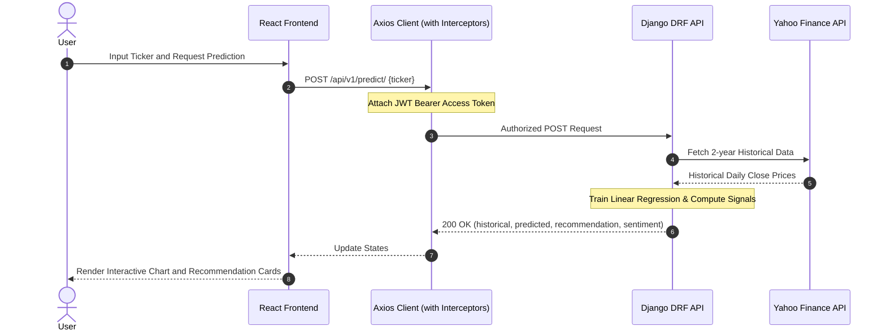

<p align="center">
  
  
  
  
</p>

## Market Vision - AI Stock Intelligence Portal

Market Vision is a professional web-based financial analytics platform designed to provide automated historical stock analysis, predictive stock price forecasting, and automated investment signal metrics. The system features a responsive React frontend styled with modern Bootstrap components and glassmorphism elements, paired with a Django REST Framework backend orchestrating mathematical analysis and external financial data pipelines.

## Project Demonstrations

Below are the visual recordings and interface references demonstrating the core operational pages and system flows.

### User Authentication Interface
The account creation and login workflow provides standard security and direct session transition from registration.

<div align="center">
  
  
</div>

### Landing Page & Entrance Transitions
This clip captures the modern entry interface, including the accelerated logo animations and the staggered text fading transitions designed for responsive screen ratios.


### Platform Walkthrough
This video shows the dashboard interface, real-time interactive y-axis stock charts, AI signal widgets, and the dynamic responsive portfolio tracker.


---

##  Why Market Vision?
 
Most financial platforms overwhelm users with bloated UIs and complex indicators. Market Vision strips that away:
 
1. **Zero Setup Clutter** — No MACD, RSI, or Bollinger Bands. Just clean **BUY / SELL / HOLD** signals.
2. **Instant Value** — Ordinal linear regression on historical closing data delivers a clean structural trendline.
3. **Responsive Management** — Portfolio tracker and watchlist that works on both desktop and mobile.
4. **Lightweight Deployability** — Runs on Render, Docker, or any standard Linux box with no GPU required.
---
 
## ⚙️ Core Feature Architecture
 
| Functional Area | Feature Description | Key Technology |
| :--- | :--- | :--- |
| **Snappy Interface** | Glassmorphic landing page with staggered entrance animations | React, CSS, Bootstrap 5 |
| **Interactive Charting** | Dual-line historical vs predicted charts with hover tooltips | Recharts |
| **Ticker Resolution** | Converts company names to official exchange ticker symbols | Yahoo Finance API |
| **Trend Forecasting** | 30-day directional price forecast computed server-side | Scikit-Learn, Pandas |
| **Risk Metrics** | Daily return standard deviation over 30-day trading window | NumPy, Pandas |
| **Sentiment Analysis** | Momentum tracking via sliding window historical averages | NumPy |
| **Portfolio Tracker** | Live P&L calculations based on shares and purchase cost | React Hooks, Axios |
| **Secure Auth** | JWT session security with automatic token refresh loops | Django SimpleJWT |
 
---
 
##  Algorithmic Stock Calculations
 
### 1. Future Price Forecasting (Linear Regression)
 
The backend trains a Scikit-Learn Linear Regression model on 2 years of historical closing prices.
 
- **X** = ordinal representation of date (`pandas.Timestamp.toordinal`)
- **y** = daily closing price
Model equation:
 
```
y = m*X + c
```
 
Where `m` is the trend slope and `c` is the intercept. Future prices for the next 30 trading days are predicted as:
 
```
Predicted Price = m * (Future Date Ordinal) + c
```
 
---
 
### 2. AI Investment Signal & Confidence Score
 
Projected percentage change between the 30-day average predicted price and today's close:
 
```
Change % = ((avg_predicted - current_price) / current_price) * 100
```
 
**Signal Triggers:**
- `BUY`  → Change % > +5%
- `SELL` → Change % < -5%
- `HOLD` → Change % in [-5%, +5%]
**Confidence:**
- BUY/SELL: `min(95%, 60% + 2 * |Change %|)`
- HOLD:     `max(40%, 70% - 3 * |Change %|)`
---
 
### 3. Risk Level Determination
 
Daily return for each trading day:
 
```
R(t) = (P(t) - P(t-1)) / P(t-1)
```
 
Volatility = standard deviation of R over last 30 days × 100
 
| Volatility | Risk Level |
|---|---|
| < 1.5% | 🟢 Low |
| 1.5% – 3.0% | 🟡 Medium |
| ≥ 3.0% | 🔴 High |
 
---
 
### 4. Market Sentiment Scoring
 
```
Momentum   = (avg_last_20 - avg_prev_20) / avg_prev_20 * 100
Short Trend = (current - day5_ago) / day5_ago * 100
Score       = 50 + (3 * Momentum) + (2 * Short Trend)   [clamped 0–100]
```
 
| Score | Sentiment |
|---|---|
| ≥ 65 | 📈 Bullish |
| ≤ 35 | 📉 Bearish |
| 35–65 | ➡️ Neutral |
 
---
 
## 🔌 API Integration Architecture
 

 
### Key API Endpoints
 
####  Authentication
| Method | Endpoint | Description |
|---|---|---|
| POST | `/api/v1/register/` | Register a new user |
| POST | `/api/v1/token/` | Get JWT access + refresh tokens |
| POST | `/api/v1/token/refresh/` | Refresh an expired access token |
 
#### 📊 Stock Prediction
| Method | Endpoint | Description |
|---|---|---|
| POST | `/api/v1/predict/` | Run full prediction pipeline (JWT required) |
| POST | `/api/v1/batch-prices/` | Batch live price updates for watchlist/portfolio (JWT required) |
 
**Predict payload:** `{ "ticker": "TSLA" }`  
**Batch payload:** `{ "tickers": ["AAPL", "MSFT", "GOOGL"] }`
 
### Token Auto-Refresh Interceptor
 
- **Request interceptor** — attaches `Authorization: Bearer <token>` to every request
- **Response interceptor** — on `401`, silently calls `/token/refresh/`, retries the original request, redirects to `/login` if refresh also fails
---
 
## Local Setup
 
### Backend (Django)
```bash
cd backend-drf
python -m venv venv
source venv/bin/activate      # Windows: venv\Scripts\activate
pip install -r requirements.txt
python manage.py migrate
python manage.py runserver
```
 
### Frontend (Vite + React)
```bash
cd frontend-react
npm install
```
 
Create a `.env` file:
```env
VITE_BACKEND_BASE_API=http://127.0.0.1:8000/api/v1/
```
 
```bash
npm run dev
```
