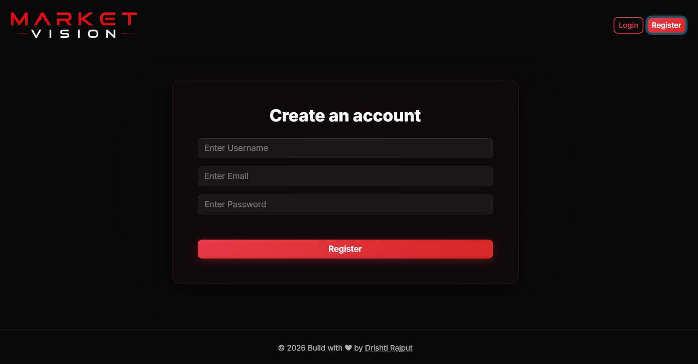
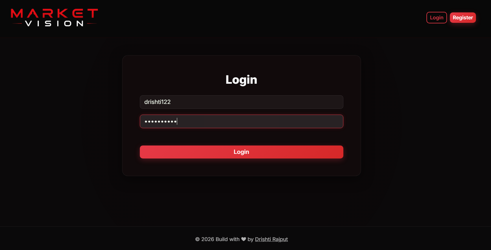
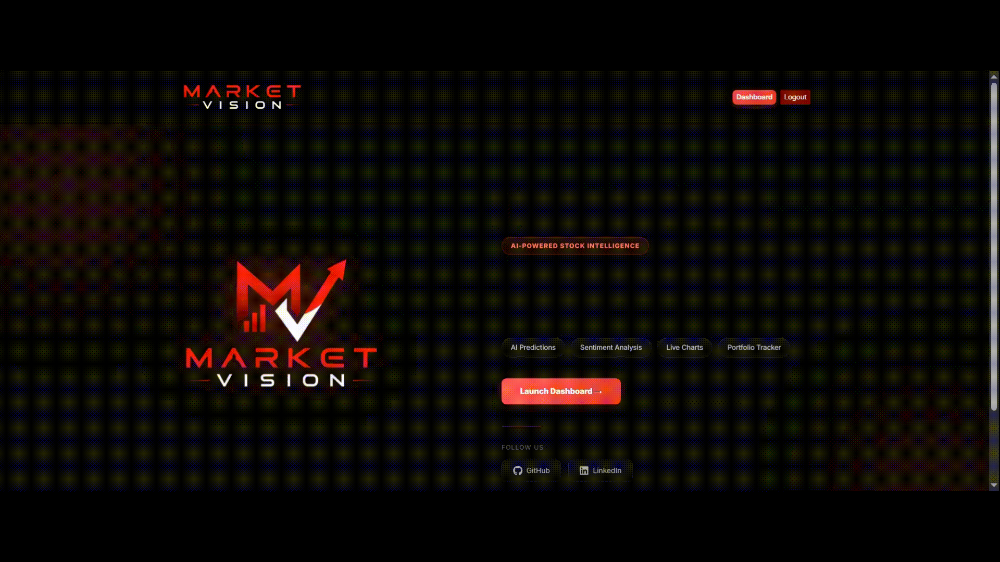
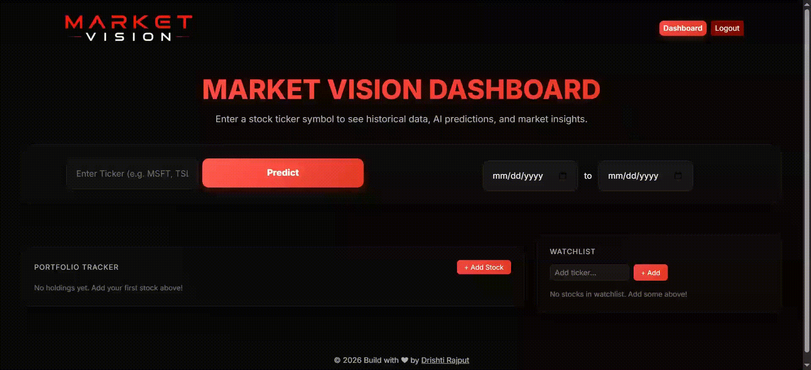
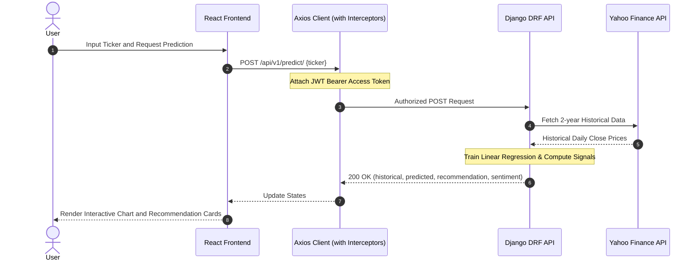

<p align="center">
  
  
  
  
</p>

# Market Vision - AI Stock Intelligence Portal

Market Vision is a professional web-based financial analytics platform designed to provide automated historical stock analysis, predictive stock price forecasting, and automated investment signal metrics. The system features a responsive React frontend styled with modern Bootstrap components and glassmorphism elements, paired with a Django REST Framework backend orchestrating mathematical analysis and external financial data pipelines.

## Project Demonstrations

Below are the visual recordings and interface references demonstrating the core operational pages and system flows.

### User Authentication Interface
The account creation and login workflow provides standard security and direct session transition from registration.

<div align="center">
  
  
</div>

### Landing Page & Entrance Transitions
This clip captures the modern entry interface, including the accelerated logo animations and the staggered text fading transitions designed for responsive screen ratios.




### Platform Walkthrough
This video shows the dashboard interface, real-time interactive y-axis stock charts, AI signal widgets, and the dynamic responsive portfolio tracker.




---

## Why Market Vision? (Simplicity & Value)

Many financial terminals and trading platforms overwhelm users with bloated user interfaces, excessive indicators, and convoluted setup procedures. Market Vision stands out because of its absolute simplicity and streamlined intelligence:

1. **Zero Setup Clutter**: Instead of reading dozens of complex charting indicators like MACD, RSI, and Bollinger Bands, users are presented with simplified, high-confidence signal outcomes: BUY, SELL, or HOLD.
2. **Instant Value Realization**: By using ordinal linear regression and volatility indexes on historical closing data, the portal strips away market noise to deliver a clean trendline that shows where the stock price is structurally headed.
3. **Responsive Management**: Includes an integrated portfolio tracker and watchlist that calculates asset changes dynamically on both desktop monitors and small mobile viewports.
4. **Lightweight Deployability**: The architecture runs efficiently on simple Docker instances, Render platforms, or standard Linux boxes without requiring expensive GPU infrastructure.

---

## Core Feature Architecture

The table below outlines the primary functional capabilities of the platform alongside the underlying technologies driving them:

| Functional Area | Feature Description | Key Technology Utilized |
| :--- | :--- | :--- |
| **snappy Interface** | Glassmorphic aesthetic landing page, interactive mobile layout, and staggered title entrance. | React, Vanilla CSS, Bootstrap 5 |
| **Interactive Charting** | Dual-line historical versus future pricing charts with localized formatting and dynamic hover tooltips. | Recharts, React Responsive Containers |
| **Ticker Resolution** | Automatic conversion of casual company names into official exchange ticker symbols. | Yahoo Finance Search API, Python Requests |
| **Trend Forecasting** | 30-day directional pricing forecast computed instantly on the server. | Scikit-Learn Linear Regression, Pandas |
| **Risk Metrics** | Daily return standard deviation analysis over a 30-day trading window. | Numpy Statistics, Pandas |
| **Sentiment Analysis** | Short-term momentum tracking using sliding window historical average comparisons. | Numpy Mathematical Functions |
| **Portfolio Tracker** | Live profit and loss calculations based on user-inputted asset shares and purchase cost. | React Hooks, LocalStorage, Axios Batch API |
| **Secure Authentication** | Restrictive system access backed by JSON Web Token session security and automatic refresh loops. | Django Simple JWT, Axios Interceptors |

---

## Algorithmic Stock Calculations

Market Vision does not use simple random guessing. The system relies on standard statistical modeling and statistical algorithms to analyze historical volatility, project prices, and gauge general sentiment.

### 1. Future Price Forecasting (Linear Regression)
To project stock prices 30 days into the future, the backend uses a Scikit-Learn Linear Regression model.
* The independent variable ($X$) is the ordinal representation of the historical date (using `pandas.Timestamp.toordinal`).
* The dependent variable ($y$) is the daily historical closing price (`Close`) extracted over a 2-year period.
* The model is fitted to the equation:
  $$y = mX + c$$
  where $m$ is the linear slope representing the general price trend, and $c$ is the intercept.
* Future dates are projected for the next 30 days (excluding weekend trading gaps). The fitted model projects prices using these future ordinal date integers:
  $$\text{Predicted Price} = m \cdot (\text{Future Date Ordinal}) + c$$

### 2. AI Investment Signal & Confidence Score
Once the future 30-day predictions are generated, the recommendation engine calculates the overall signal:
* **Projected Percentage Change**: It calculates the difference between the average of the 30-day predicted prices ($\bar{y}_{\text{pred}}$) and the most recent close price ($P_{\text{current}}$):
  $$\text{Change \%} = \frac{\bar{y}_{\text{pred}} - P_{\text{current}}}{P_{\text{current}}} \times 100$$
* **Signal Triggers**:
  * **BUY**: Triggered if the projected price change is greater than $+5\%$.
  * **SELL**: Triggered if the projected price change is less than $-5\%$.
  * **HOLD**: Triggered if the projected price change falls within $[-5\%, +5\%]$.
* **Confidence Calculation**: The baseline confidence is set according to the intensity of the projected change:
  * For BUY/SELL: $\text{Confidence} = \min(95\%, 60\% + 2 \times |\text{Change \%}|)$
  * For HOLD: $\text{Confidence} = \max(40\%, 70\% - 3 \times |\text{Change \%}|)$

### 3. Risk Level Determination
Market risk is calculated by looking at the standard deviation of daily stock returns over the last 30 trading days:
* Daily percentage returns are computed as:
  $$R_t = \frac{P_t - P_{t-1}}{P_{t-1}}$$
* The volatility is the standard deviation ($\sigma$) of these returns converted to a percentage:
  $$\text{Volatility} = \sigma(R) \times 100$$
* **Risk Categorization**:
  * **Low Risk**: $\text{Volatility} < 1.5\%$ (typically stable blue-chip companies).
  * **Medium Risk**: $1.5\% \le \text{Volatility} < 3.0\%$.
  * **High Risk**: $\text{Volatility} \ge 3.0\%$ (volatile tech stocks or speculative assets).

### 4. Market Sentiment Scoring
The general momentum sentiment score is calculated out of 100:
* **Long-Term Momentum**: Compares the mean close price of the last 20 trading days ($\bar{P}_{\text{recent}}$) against the previous 20 trading days ($\bar{P}_{\text{older}}$):
  $$\text{Momentum} = \frac{\bar{P}_{\text{recent}} - \bar{P}_{\text{older}}}{\bar{P}_{\text{older}}} \times 100$$
* **Short-Term Trend**: Measures the price movement over the last 5 active trading days:
  $$\text{Short Trend} = \frac{P_{\text{current}} - P_{\text{day-5}}}{P_{\text{day-5}}} \times 100$$
* **Composite Score**:
  $$\text{Score} = 50 + (3 \times \text{Momentum}) + (2 \times \text{Short Trend})$$
  The score is strictly clamped between $0$ and $100$:
  * **Bullish**: $\text{Score} \ge 65$ (upward momentum dominates).
  * **Bearish**: $\text{Score} \le 35$ (downward trend dominates).
  * **Neutral**: $35 < \text{Score} < 65$.

---

## API Integration Architecture

Market Vision uses a clean decoupled architecture where the React frontend communicates with the Django REST Framework (DRF) backend exclusively via JSON endpoints.



### Key API Endpoints

#### 1. User Authentication & Authorization
* **POST** `/api/v1/register/`: Registers a new user account (returns success confirmation).
* **POST** `/api/v1/token/`: Exchange credentials for a JWT Access Token and Refresh Token.
* **POST** `/api/v1/token/refresh/`: Exchange a valid Refresh Token for a new Access Token.

#### 2. Stock Prediction Pipeline
* **POST** `/api/v1/predict/`: Core analytics endpoint (Requires JWT Header).
  * **Payload**: `{ "ticker": "TSLA" }`
  * **Response**: A nested JSON object including resolved ticker name, historical closing list, predicted closing list, recommendation signal metrics, and sentiment indices.

#### 3. Real-Time Dashboard Batch Updates
* **POST** `/api/v1/batch-prices/`: Batch price updates for Watchlist and Portfolio (Requires JWT Header).
  * **Payload**: `{ "tickers": ["AAPL", "MSFT", "GOOGL"] }`
  * **Response**: An object mapped by ticker symbol, containing current close price, previous close price, and calculated daily percentage change.

### Token Lifecycle & Auto-Refresh Interceptor
To protect endpoints while keeping the user experience simple, the frontend Axios instance uses automatic request and response interceptors:
* **Request Interceptor**: Automatically attaches the stored `access_token` as an `Authorization: Bearer <token>` header to all outgoing requests.
* **Response Interceptor**: Monitors incoming API errors. If a request returns a `401 Unauthorized` status (indicating the access token expired):
  1. The interceptor pauses the original request.
  2. It hits `/api/v1/token/refresh/` using the stored `refresh_token`.
  3. Upon a successful refresh, it updates the stored tokens, adjusts the headers of the original request with the new access token, and executes it again transparently.
  4. If the refresh token has also expired, it wipes the browser credentials and seamlessly redirects the user to `/login`.

---

## Technical Deployment Guidelines

Follow these directions to run both the backend and frontend services locally or to configure production builds.

### Backend Setup (Django)
1. Navigate to the backend directory:
   ```bash
   cd backend-drf
   ```
2. Create and activate a Python virtual environment:
   ```bash
   python -m venv venv
   source venv/bin/activate # On Windows: venv\Scripts\activate
   ```
3. Install the dependencies:
   ```bash
   pip install -r requirements.txt
   ```
4. Run migrations and start the Django development server:
   ```bash
   python manage.py migrate
   python manage.py runserver
   ```

### Frontend Setup (Vite React)
1. Navigate to the frontend directory:
   ```bash
   cd ../frontend-react
   ```
2. Install npm packages:
   ```bash
   npm install
   ```
3. Set up environment variables in a `.env` file inside the frontend directory:
   ```env
   VITE_BACKEND_BASE_API=http://127.0.0.1:8000/api/v1/
   ```
4. Run the frontend build or start the Vite server:
   ```bash
   npm run dev
   ```
